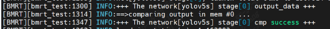

运行时库使用
============

运行时库安装
------------------

从 https://github.com/sophgo/libsophon/tree/SGTPUV8 获取libsophon源码，注意需要SGTPUV8分支。按照主页步骤编译、安装libsophon。

安装完成后会在 ``{/path/to/libsophon}/bin`` 目录下会出现模型测试程序bmrt_test。

将模型转换步骤中得到包含compilation.bmodel的模型目录作为输入，执行以下命令：

.. code-block:: shell

    $ .{/path/to/libsophon}/bin/bmrt_test --context_dir {path_to_compilation_dir}

出现以下内容时表示运行模型且比对成功：

.. code-block:: shell

    注意：这部分内容需要在SOC环境使用

推理程序开发
------------------

参考 https://github.com/sophgo/libsophon/tree/SGTPUV8/tpu-runtime tpu-runtime仓库的主页介绍，使用bmlib和BMRuntime推理接口编写推理程序。

推理程序示例代码：https://github.com/sophgo/libsophon/blob/SGTPUV8/tpu-runtime/docs/reference/source_zh/bmruntime_sample/bmruntime_sample.rst。

.. code-block:: shell

    注意：这部分内容需要在SOC环境使用